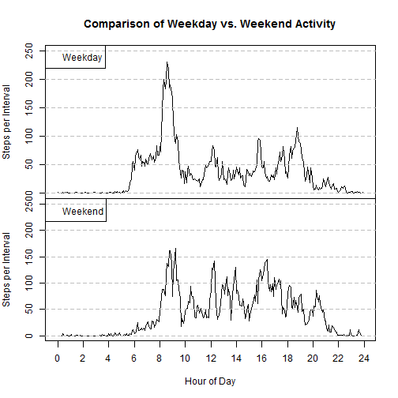

## Loading and preprocessing the data

We read the data file **activity.csv** with *read.csv()*, and add a POSIXct date object and a
variable to distinguish weekends from weekdays.

We also add a convenience variable **itimes** which represents the intervals as the decimal number
of hours in a 24-hour day.


```r
adf <- read.csv('activity.csv')
adf$date <- as.POSIXct(adf$date)
adf$wkday <- weekdays(adf$date)
adf$wkend <- 'weekday'
adf$wkend[adf$wkday=='Saturday' | adf$wkday=='Sunday'] <- 'weekend'

itimes <- seq(0,287) / 12 # 5-minute intervals expressed as hours
```


## What is mean total number of steps taken per day?

We use the *dplyr* library to group observations by day.


```r
d_adf <- group_by(adf, date)
d_stats <- summarise(d_adf, 
                     avsteps=mean(steps,na.rm=TRUE),
                     totsteps=sum(steps,na.rm=TRUE),
                     count=n(),
                     nintvl=length(steps[!is.na(steps)]))

hist(d_stats$totsteps, breaks=seq(0,25000,by=1000),
     main='Histogram of Steps per Day',
     xlab='Steps per Day', ylab='Number of Days')
```

 

Note that the tall bar at 0 steps includes 8 days of missing (not zero) data.


```r
meanSpD <- mean(d_stats$totsteps, na.rm=TRUE)
medSpD <- median(d_stats$totsteps, na.rm=TRUE)
```

Median number of steps per day: **10395**

Mean number of steps per day: **9354.2295**

## What is the average daily activity pattern?

We use *dplyr* again, this time to group observations by interval.


```r
i_adf <- group_by(adf, interval)
i_stats <- summarise(i_adf, 
                     avsteps=mean(steps,na.rm=TRUE),
                     totsteps=sum(steps,na.rm=TRUE),
                     count=n(),
                     ndays=length(steps[!is.na(steps)]))
imax <- which.max(i_stats$avsteps)
intvlMax <- i_stats$interval[imax]
maxHr <- floor(intvlMax / 100.)
maxMin <- intvlMax %% 100
```

Interval with max number of steps is **835** corresponding to a clock time
of 8:35.

 

## Imputing missing values


```r
iMiss <- which(is.na(adf$steps))
nMiss <- length(iMiss)
```

There are **2304** intervals with missing data, representing 8 24-hour days with no data.
We'll fill them with the average of the corresponding
non-missing values for that interval. (Note that day 2012-11-15 has only 41 steps and 
286 no-step intervals, but *NO* missing intervals. We only fill missing data, not zero data, so
there will still be zero-valued records in the filled dataset.)


```r
# create a block of data that will be used to fill missing values
# This is more complicated than it needs to be for this case (where complete days are missing)
#   but could be used if random observations were missing.

intvlMiss <- adf$interval[iMiss]
fillVal <- sapply(intvlMiss, function(iv) i_stats$avsteps[which(i_stats$interval==iv)])

adfFill <- adf
adfFill$steps[iMiss] <- fillVal

# use dplyr to summarise by date

dFill_stats <- summarise(group_by(adfFill, date), 
                     avsteps=mean(steps,na.rm=TRUE),
                     totsteps=sum(steps,na.rm=TRUE),
                     count=n(),
                     nintvl=length(steps[!is.na(steps)]))

hist(dFill_stats$totsteps, breaks=seq(0,25000,by=1000),
     main='Histogram of Steps per Day (filled data)',
     xlab='Steps per Day', ylab='Number of Days')
```

 

```r
meanSpD <- mean(dFill_stats$totsteps, na.rm=TRUE)
medSpD <- median(dFill_stats$totsteps, na.rm=TRUE)
```

Median number of steps per day (after filling): **1.0766 &times; 10<sup>4</sup>**

Mean number of steps per day (after filling): **1.0766 &times; 10<sup>4</sup>**

Since the filling operation filled in complete days, the effect on the histogram has been to 
increase the height of the bar containing the average number of steps in the filling data
by 8 (the number of complete days that have been filled.)

## Are there differences in activity patterns between weekdays and weekends?

We use *dplyr* to generate summaries for both weekday and weekend days.


```r
iwd_adf <- group_by(adfFill[adfFill$wkend=='weekday',], interval)
iwd_stats <- summarise(iwd_adf, 
                     avsteps=mean(steps,na.rm=TRUE),
                     totsteps=sum(steps,na.rm=TRUE),
                     count=n(),
                     ndays=length(steps[!is.na(steps)]))

iwe_adf <- group_by(adfFill[adfFill$wkend=='weekend',], interval)
iwe_stats <- summarise(iwe_adf, 
                     avsteps=mean(steps,na.rm=TRUE),
                     totsteps=sum(steps,na.rm=TRUE),
                     count=n(),
                     ndays=length(steps[!is.na(steps)]))
```


 
We can see by comparing these two curves that our subject likes to sleep in 
and stay up later on the weekends.
